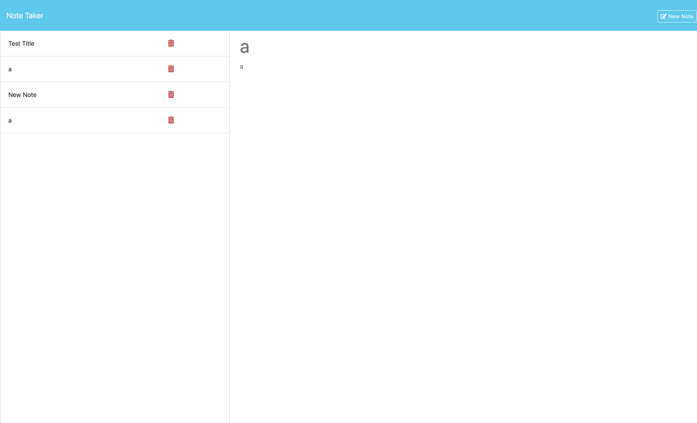

# Note Taker

## Description
A simple note taking app built with Node.js, Express, and Bootstrap.
View deployed app [here](https://express-note-taker-ag-4434075321af.herokuapp.com/)

## App Demo

## Table of Contents
- [Features](#features)
- [Getting Started](#getting-started)
- [License](#license)
- [Acknowledgements](#acknowledgments)

## Features

- Create, read, update, and delete notes
- Save and load notes to/from a JSON file
- Responsive design with Bootstrap

## Getting Started

1. Clone this repository: `git clone https://github.com/tylerhagerty/note-taker.git`
2. Run `npm install` to install dependencies
3. Run `npm start` to start the server
4. Open [http://localhost:3000](http://localhost:3000) with your web browser

## License

This project is licensed under the MIT License - see the [LICENSE](LICENSE) file for details

## Acknowledgments

- Code built upon code base provded by edX and KU.
